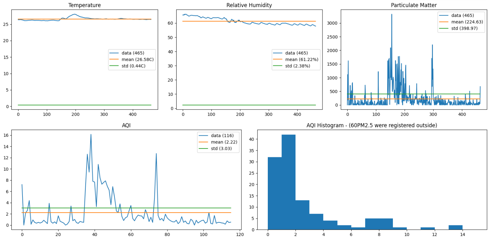

# Air Quality Control

## Dashboard

In this dashboard, for the first four graphs we are showing the Temperature measures with its mean and standar deviation. 
The last one is an histogram of the AQI values, and it also says the relation with the AQI outside the house (locating the user zone by its zipcode or by latitude and longitude).  
There it is also an implementation of audio alerts for the users, that warn them in case the consentration of PM are too high, that the relative humidity is above 95%, or that the celsius degrees are above 46 which both things provoke the air dust sensor to fail.

## Alarms

https://github.com/sergioscattone/DGMD-S14/assets/28077819/1971c597-5356-4baf-a0e9-539ff2d7a514

We have alarms that we trigger in case we detect there is a risk for the user health in our Arduino measures.  
We have ser alarms for when: temperature is over 45 celsius grades, relative humidity is over 95%, AQI is over inside the house than outside, AQI is over a high level (regarding how high outside)

## Demo

https://github.com/sergioscattone/DGMD-S14/assets/28077819/623c0216-bbf1-447c-b4d4-84fe7ad770af

In this demo video we show how we are taking the sensors data from the Arduno device inside the house. You can check all the details below in the Hardware section.

Full video: [Andruino](https://drive.google.com/file/d/1E_q9jlfPgq9t-DJUWl3hPuZjOScIvuit/view)

## Introduction
In a world dealing with increasing wildfires, growing pollution, and other environmental concerns, the air we breathe can be negatively affected. At the same time, consumers are becoming more health conscious. This creates a market for wearable air quality monitors and air purifiers, which has not yet fully been explored.

Our project aims to create an air quality sensor that could be used as a wearable and inform the user if the air quality around them is poor, prompting them to take action by turning on an air purifier or wearing a mask.  
We will use an Arduino dust sensor to build out a physical device, and display the output on a dashboard.  
On the dashboard we will also pull in air quality measures from other sources, like the Environmental Protection Agency (EPA). 

## Definitions

### AQI
The EPA developed the AQI, which reports levels of ozone, particle pollution, and other common air pollutants on the same scale. 
An AQI reading of 101 corresponds to a level above the national air quality standard - the higher the AQI rating, the greater the health impact. To know more about the AQI you can go to: [https://docs.airnowapi.org/aq101] 

### PM
We will be focusing on measuring levels of particulate matter (PM) in the immediate area of the device using an Arduino dust sensor.  
The Arduino dust sensor collects counts of particles greater than 1 micron in size as air flows through the sensor.  
From those particle counts, we will have to estimate the total mass of particles present, as mass is the official reported standard for particulate matter used by the EPA.  
From those masses, we will be able to determine the Air Quality Index (AQI) measurement for particulate matter. 

## Background and Context: Hardware

### Arduino

We have an Arduino Uno Board attached to a grove input shield.  
We connect this board to a laptop over USB which provides both power and a means of bi-directional data transfer.  
We use the microcontroller to take measurements every 30 seconds and pass that information to the serial port where additional processing or data transfer can take place. In our proof of concept we directly stream the serial port output and write it to a csv.

### Seeedlabs Temperature and humidity sensor

The Seedlabs temperature and humidity sensor outputs temperature in celsius and relative humidity
as digital values.  
We read these alongside the PM sensor as the sensor cannot properly function above 45 degrees celsius or 95% humidity. 

### Seeedlabs Grove Dust Sensor

The Seeedlabs Grove Dust Sensor is a Shinyei PPD42 dust sensor vendored by Seeed Labs to be connected to an  Arduino board over a grove connector that reliably measure particles in between 1um and 2.5ums in size.  
When there are particles present, the sensor switches from producing a high voltage output to a low voltage output.  
To calculate the particle concentration, we regularly sample the output of the sensor and  calulate the percentage of time that the sensor is producing low voltage output. We then use anequation (sourced from sensor documentation) to calculate the number of particles per 0.01 cubic feet of air taking the ratio of low pulse occupancy as input.

To calculate pm2.5 concentration as mass per cubic meter of air, we convert the particle count from particles per 0.01 cubic feet to particles per cubic meter.  
We then need to make two key assumptions to enable us to calculate PM mass.  
First we need to determine the size of the particle.  
To do this, we assume that all detected partcles are uniformly distributed in size within the sensors detectable range (1um-2.5um), therefore we assume that all particles are of  the mean of  that rante, with a diameter of 1.75um.  
We also assume that all particles have the unit density, an assumption we've seen applied by [past studies](https://academic.oup.com/annweh/article/50/8/843/154938) using low cost sensors.  
We then calculate the total mass by multiplying the volume of the average particle (assuming that it's spherical) by the unit density and multiplying it by the particle count.

## Background and Context: Software

In this section we will take the input from the sensors and we will show it in different graphs.  
We are using colab as tool to interact with each other and apply advances in our code.  
For that reasons we have our graph solutions made in python with [Matplotlib](https://matplotlib.org/).  
For gathering the enviromental information we are calling different APIs from [AirNowAPI](https://docs.airnowapi.org/).  
Here it is our [colab notebook](https://colab.research.google.com/drive/1L0fGcY5KhRBeFsvSIR6Plb1Gl8LK7w7u) where we have many examples of API calls, examples of different many analysis of parameters with their correlative graphs.  
In the colab file you will find evaluation of Temperature measure, Relative Humidity measure, Particulates Matter measure, a simulation of the effect of an air purifier, an AQI calculator and a comparative from the values inside the house and outside using the AirNowApi.  
In this repository you will find the colab notebook in the [colab_notebook.ipynb](colab_notebook.ipynb) file which basically is the colab notebook exported.

### Sensonrs data

For collecting the sensors' data we use an script that is in [get_pm.in](get_pm.ino).  
The algorithms used to calculate the AQI from the sensor data is modularized in the [pm_utils.py](pm_utils.py) file.  
However, both colab notebook and python dashboard files have integrated all that is needed to run without the need to include the get_pm.ino file.

### Samples

In the <b>data_samples</b> folder you will see two files with samples that we have taken with the Andruino device. In them we have put the sensors close to a kitchen while using it to see the efects in the measures.

### License
All the sotfware presented in this repo is under [MIT License](LICENSE).